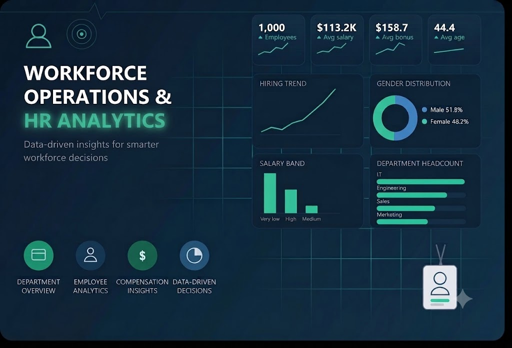
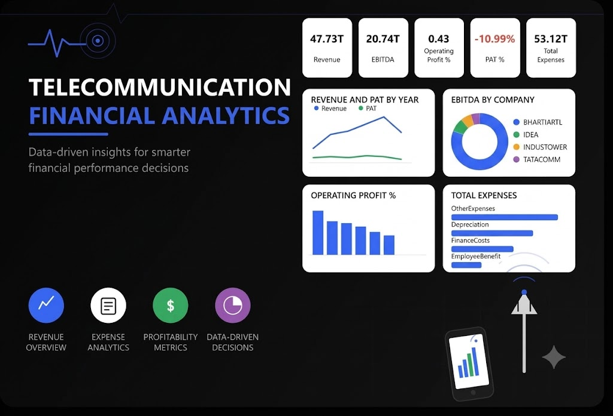
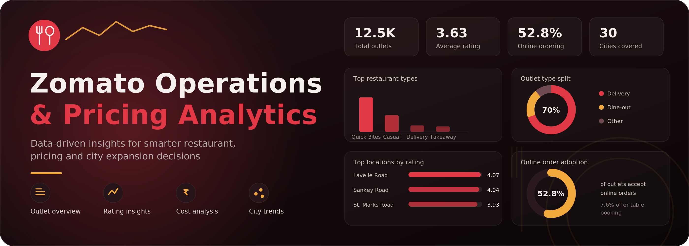
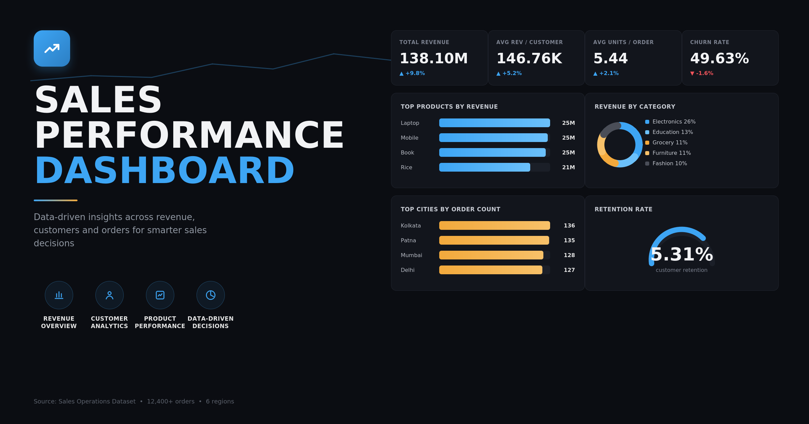
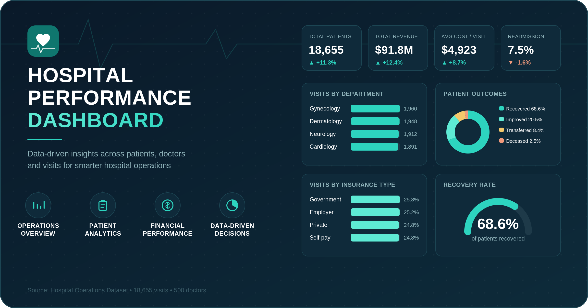

<div align="center">

# 📊 Insights Lab — Data Analyst Portfolio

### *Turning Raw Data into Decisions that Matter.*


**[🌐 Live Portfolio](https://tushar118mca.github.io/Tushar_portfolio/#home)** · **[📄 Resume](Resume/Tushar_Data_Analyst_Resume2.pdf)** · **[💼 LinkedIn](https://linkedin.com/in/tushar118mca)** 

</div>

---

## 👋 Hi, I'm Tushar Nimbekar

I'm a **Data Analyst** (MCA, JSPM University, Pune) who enjoys digging for the story behind the numbers. I take messy, real-world datasets — 50,000+ records at a time — and turn them into clean pipelines, sharp SQL, and **interactive Power BI dashboards** that non-technical stakeholders can act on immediately.

This repository is the source code of my personal portfolio website: a dark, cyan-accented, fully responsive single-page site that showcases my projects, skills, experience, and certifications.

> 🎯 **Currently looking for:** Data Analyst / Business Analyst / Research Analyst roles where I can apply Python, SQL, and Power BI to real business problems.

---

## ✨ Portfolio Features

| Feature | Description |
|---|---|
| 🧭 **Smart navigation** | Sticky navbar with active-section highlighting (`aria-current` support) |
| 🗂️ **Filterable projects** | Tab filter to switch between *All*, *Data Analytics*, and *Internship* projects |
| 🧩 **Problem → Approach → Result** | Every project card is written as a mini case study, not just a screenshot |
| 📬 **Contact form** | Opens a pre-filled Gmail compose window — no backend needed |
| 📥 **One-click resume** | Download my resume straight from the hero section |
| 🎨 **Custom dark theme** | Hand-written CSS with a cyan design system (no frameworks) |
| ♿ **Accessible** | Semantic HTML, ARIA labels, screen-reader-only form labels, keyboard-focusable cards |
| 📱 **Responsive** | Grid/flex layouts that adapt from desktop to mobile |

---

## 🚀 Featured Projects

### 📁 Data Analytics Projects

<table>
<tr>
<td width="33%" valign="top">

**👥 HR Analytics Dashboard**



Cleaned 1,000 employee records (172 duplicates flagged), modeled in PostgreSQL with window functions & reusable views, and built a 3-page Power BI dashboard.

💡 *Uncovered a mislabeled salary band classifying top earners as "Very Low".*

`Python` `SQL` `DAX` `Power BI`

[🔗 View Project](https://github.com/tushar118MCA/Data_Analytics_Projects/tree/main/HR_Analytics_Project)

</td>
<td width="33%" valign="top">

**📡 Telecom Financial Dashboard**



Built a Python ETL pipeline over XBRL-style P&L filings, derived EBITDA / EBIT / PBT / PAT margins in SQL, and compared companies in Power BI.

💡 *Found a -10.99% PAT margin despite 20.74T EBITDA — one company drives ~59% of sector EBITDA.*

`Python` `SQL` `DAX` `Power BI`

[🔗 View Project](https://github.com/tushar118MCA/Data_Analytics_Projects/tree/main/Telecommunication_Dashboard_Project)

</td>
<td width="33%" valign="top">

**🍽️ Zomato Analytics Dashboard**



Cleaned and modeled 51K+ restaurant listings across 30 cities, with a PostgreSQL backend and a Power BI dashboard on ratings, pricing, and online ordering.

💡 *Online-order-enabled outlets averaged meaningfully higher ratings than offline-only ones.*

`Python` `SQL` `DAX` `Power BI`

[🔗 View Project](https://github.com/tushar118MCA/Data_Analytics_Projects/tree/main/Zomato_Dashboard)

</td>
</tr>
</table>

### 💼 Internship Projects

<table>
<tr>
<td width="50%" valign="top">

**🛒 Sales Analytics Project**



Power BI dashboard on 12,400+ orders with KPI tracking, trend analysis, and demographic breakdowns.

💡 *Surfaced a 49.6% churn rate and revenue concentrated in just two cities and two product segments.*

`Python` `SQL` `DAX` `Power BI`

[🔗 View Project](https://github.com/tushar118MCA/Internship_Projects/tree/main/Sales_Dashboard)

</td>
<td width="50%" valign="top">

**🏥 Hospital Performance & Patient Outcomes**



Cleaned 18K+ visits into a 3-table relational schema (patients, doctors, visits) and validated SQL KPIs feeding a Power BI dashboard.

💡 *Found a 7.5% readmission rate and 18% cost variance across departments.*

`Python` `SQL` `DAX` `Power BI`

[🔗 View Project](https://github.com/tushar118MCA/Internship_Projects/tree/main/Hospital_Performance_Dashboard)

</td>
</tr>
</table>

---

## 🛠️ Tech Stack

**Analytics & BI**


**Tools**


**Portfolio Website**


---

## 🎓 Education & Certifications

| 🎓 Education | Institution | Period | CGPA |
|---|---|---|---|
| Master of Computer Applications (MCA) | JSPM University, Pune | 2024 – 2026 | 7.64 / 10 |
| Bachelor of Computer Applications (BCA) | SPPU University, Pune | 2021 – 2024 | 8.28 / 10 |

| 📜 Certification | Issuer | Date |
|---|---|---|
| Business Intelligence & Analytics | NPTEL (IIT Madras) — *Elite* | Jan–Apr 2026 |
| Programming with Python Professional Certificate | OpenEDG Python Institute · LinkedIn Learning | Jun 2025 |
| Data Analytics Job Simulation | Deloitte · Forage | Jul 2026 |
| The Ultimate MySQL Crash Course | Udemy | Sep 2026 |

---

## 📂 Project Structure

```text
portfolio/
├── index.html                 # Main single-page site (all sections)
├── style.css                  # Custom dark/cyan design system
├── script.js                  # Nav highlighting, project filter, contact form
├── Images/
│   ├── animated_image1.jpg    # Contact section illustration
│   └── animated_image2.jpg    # About section portrait
├── project-banners/           # Dashboard preview images
│   ├── hr-analytics.jpg
│   ├── telecommunication-financial.png
│   ├── zomato-analytics.png
│   ├── sales_dashboard_banner.png
│   └── hospital-performance.png
├── certificate-images/        # Certification previews
│   ├── Buiness_Intelligence_analytics_certificate.png
│   ├── Python_Professional_Certificate.png
│   ├── Deloitte_Data_analytics_certificate.png
│   └── MYSQL_Crash_course_Certificate.png
├── Resume/
│   └── Tushar_Data_Analyst_Resume2.pdf
├── LICENSE                    # MIT License (code only)
└── README.md
```

---

## ⚙️ Run It Locally

No build step, no dependencies — it's pure HTML, CSS, and JavaScript.

```bash
# 1. Clone the repository
git clone https://github.com/tushar118MCA/<your-repo-name>.git

# 2. Move into the folder
cd <your-repo-name>

# 3. Open in your browser
#    Option A: just double-click index.html
#    Option B: serve it locally
python -m http.server 8000
# then visit http://localhost:8000
```


---

## 🎨 Design Notes

| Token | Value |
|---|---|
| Background | `#14181d` |
| Cards | `#1e242c` |
| Primary accent | `#00e5ff` (cyan) |
| Secondary accent | `#00b4d8` |
| Muted text | `#94a3b8` |
| Font | Inter → system-ui fallback stack |

---

## 📜 License

The **source code** of this website (`index.html`, `style.css`, `script.js`) is released under the [MIT License](LICENSE) — you're welcome to fork it, learn from it, and adapt it for your own portfolio.


---

## 📬 Let's Connect

Have an interesting project or an open role? I'd love to hear from you.

- 💼 **LinkedIn:** [linkedin.com/in/tushar118mca](https://linkedin.com/in/tushar118mca)
- 🐙 **GitHub:** [github.com/tushar118MCA](https://github.com/tushar118MCA)
- 📍 **Location:** Pune, Maharashtra, India

---

<div align="center">

⭐ *If you liked this portfolio, consider giving the repo a star!* ⭐

Code licensed under [MIT](LICENSE) · Personal content © 2026 Tushar Nimbekar. All rights reserved.

</div>
